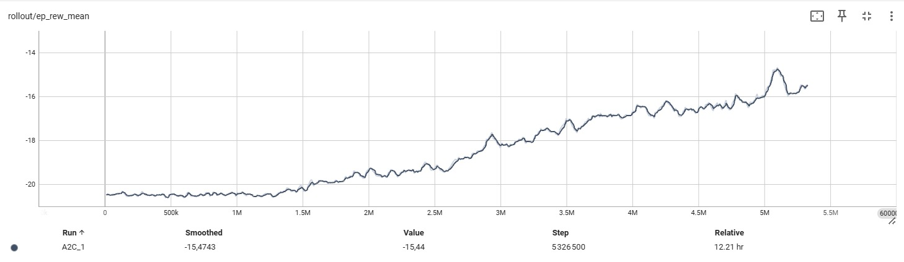
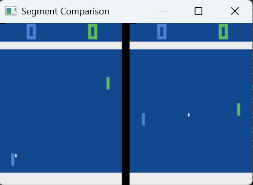
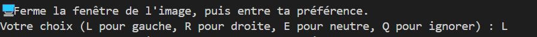

# Deep-Reinforcement-Learning-From-Human-Preferences-M2DS

This repo shows our work on the article[Deep Reinforcement Learning from Human
Preferences](https://blog.openai.com/deep-reinforcement-learning-from-human-preferences/),
based on the paper <https://arxiv.org/pdf/1706.03741.pdf>.

To structure our code, we inspired ourselves from the pages [Deep Reinforcement Learning from Human Preferences](https://github.com/mrahtz/learning-from-human-preferences) and [Deep Reinforcement Learning from Human Preferences](https://github.com/HumanCompatibleAI/learning-from-human-preferences). 
However, we created a simpler structure, compatible with a recent version of python and torch (the work done in the github repos we mentioned is done in python 3.7 and tensorflow).

We focused on the Atari Game "Pong". 

We use python 3.9 in this repo.

To vizualize the curves and data, we use tensorboar

# Organisation of the folders 

## Pong_A2C_classic

This folder contains implementations of the Advantage Actor-Critic (A2C) algorithm for the Pong game. The A2C algorithm, as described in the referenced paper, is used to optimize the policy of Atari games.

The folder includes two scripts:

- `pong_A2C_train.py`: Implements our custom A2C algorithm for training the agent.

- `pong_A2C_module.py`: Uses the A2C implementation from the Stable Baselines library. We evaluate this module because it was used for the human preference experiments. For simplicity, we opted for the pre-existing module, but an improvement to our code could involve integrating our custom A2C implementation into the human preference experiments.

Here is the mean reward after 5millions timesteps (the results are comparable to the article's one given in the illustration)

## Pong_human_pref

This folder contains the implementation of the human preference-based learning approach from the paper. It represents the core of our work, as it directly applies the methodology described in the study. We only implemented human preferences, not synthetic preferences.

- `drlhp_test_A2C_video_pretrain.py` : Pretrains the reward model before applying the algorithm, including video rendering to facilitate preference selection.

- `drlhp_test_A2C_video.py` and `drlhp_train_A2C_video.py` : Train the model using human preferences with video rendering, allowing for accurate preference selection. To test the model, run drlhp_test_A2C_video.py.

- `drlhp_test_A2C.py` and `drlhp_train_A2C.py` : Serve as a baseline without video rendering, making manual preference selection more difficult. To test this version, run drlhp_test_A2C.py.

Here is how we can see the preferences:

Here is how we can select the preferences: 

## Pong_PPO_DQN 

This folder contains our preliminary work, where we tested different reinforcement learning algorithms on the Pong game to explore the game dynamics and establish baseline results. 
The goal was to familiarize ourselves with classic RL methods and assess their expected performance before implementing our main approach.

- `pong_DQN_bhctsntrk.py` : we tested the code provided by [DQN Algorithm for Solving Atari Pong](https://github.com/bhctsntrk/OpenAIPong-DQN) to have an idea of the results we should have. 

- `pong_DQN_train.py`  and `pong DQN_test.py`: test of the DQN algorithm with the module given by the library Stable Baseline.

- `pong_PPO_train.py`, `pong_PPO_test.py`, `pong_PPO_train_improved.py` : test of the PPO algorithm by the library Stable Baseline.
